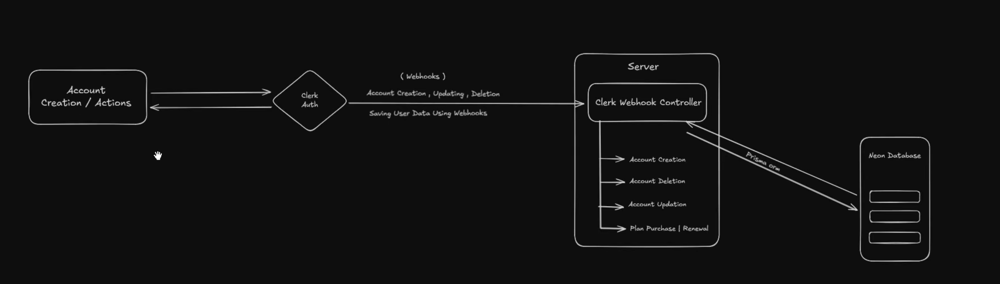
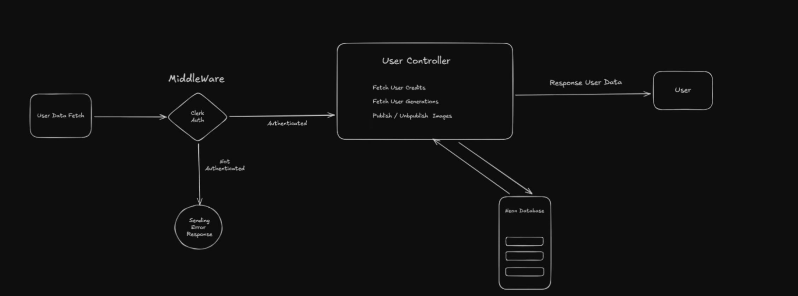
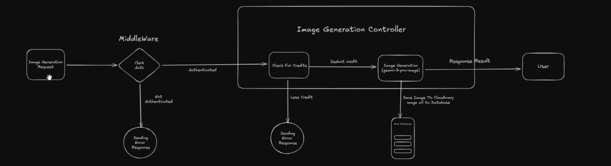
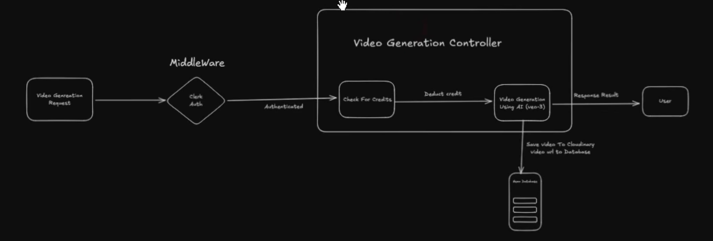

# 🎬 ShortVideoAdsGenerator

AI-powered full-stack SaaS platform that transforms product and model images into high-quality promotional creatives using Stable Diffusion and AI-driven video generation.

Built with production-grade backend architecture, credit-based monetization logic, secure webhook-based authentication, and scalable PostgreSQL design.

---

# 🚀 About This Project

It demonstrates:

- Full-stack system design
- AI model integration (local + cloud)
- Secure webhook-based authentication
- Credit-based SaaS monetization
- Cloud media storage pipeline
- Error monitoring & production debugging
- Modular backend architecture
- Real-world API design

---

# 🧠 System Architecture

```

User (React Frontend)
        ↓
Clerk Authentication (JWT)
        ↓
Express Backend (TypeScript)
        ↓
Prisma ORM
        ↓
Neon PostgreSQL
        ↓
Cloudinary (Media Storage)
        ↓
AI Services
   - Stable Diffusion (Local)
   - Google Video API (Cloud)

```

## 🔐 Authentication Flow



Clerk → Webhook → Express Controller → Prisma ORM → Neon PostgreSQL

- Clerk handles identity & JWT tokens
- Webhook syncs users into database
- Backend validates token via middleware
- User data persisted in Neon DB

---

## 👤 User Data Flow



- Middleware authentication
- Fetch user credits
- Fetch user generations
- Publish / Unpublish logic
- Controlled API responses

---

## 🖼 Image Generation Pipeline



1. User uploads Product + Model image
2. Clerk authentication middleware validates request
3. Credit validation logic runs
4. Backend calls Stable Diffusion (SD.Next API)
5. Generated image uploaded to Cloudinary
6. Metadata stored in Neon PostgreSQL

### Model Used:

`v1-5-pruned-emaonly-fp16.safetensors`

### Stable Diffusion runs locally as separate inference service.

Optimized for Apple Silicon (M1) using PyTorch MPS acceleration.

---

## 🎥 Video Generation Pipeline



1. Authenticated request
2. Credit validation
3. AI video generation (Google API)
4. Upload video to Cloudinary
5. Persist URL in database

---

# 🛠 Tech Stack

## 📈 Scalability & Design Considerations

- Stable Diffusion runs as an external inference service (service separation)
- Credit deduction is performed before AI inference to prevent resource abuse
- Webhook-based user syncing ensures database consistency
- Cloudinary used to offload heavy media storage
- Controllers modularized for horizontal scalability
- Designed to support background job queues (future improvement)

## Frontend

- React (Vite)
- Prebuilt UI Template (Customized & Modified)
- Clerk Authentication
- Axios

## Backend

- Node.js
- Express.js
- TypeScript
- Prisma ORM
- Neon PostgreSQL
- Cloudinary
- Sentry (Error Monitoring)

## AI Stack

- Stable Diffusion (SD.Next)
- Google Video API

---

# 📂 Project Structure

```bash
ShortVideoAdsGenerator/
│
├── client/                 # React frontend
│   ├── src/
│   ├── components/
│   ├── pages/
│   └── configs/
│
├── server/                 # Express backend
│   ├── controllers/
│   │   ├── userController.ts
│   │   ├── projectController.ts
│   │
│   ├── routes/
│   ├── middlewares/
│   ├── configs/
│   ├── prisma/
│   └── server.ts
│
├── docs/                   # Architecture diagrams
│   ├── auth-architecture.png
│   ├── user-controller.png
│   ├── image-generation.png
│   └── video-generation.png
│
└── README.md
```

## ⚙️ Running Locally (MacBook M1)

### 1️⃣ Start Stable Diffusion

```bash
PYTHON=/opt/homebrew/bin/python3.10 ./webui.sh
```

### 2️⃣ Start Backend

```bash
cd server
npm install
npm run server
```

### 3️⃣ Start Frontend

```bash
cd client
npm install
npm run dev
```

### 4️⃣ Optional: Expose Backend via ngrok

```bash
ngrok http 4000
```

---

## 🔐 Environment Variables

### Server `.env`

```env
DATABASE_URL=
CLERK_SECRET_KEY=
CLOUDINARY_URL=
SENTRY_DSN=
GOOGLE_API_KEY=
```

### Client `.env`

```env
VITE_CLERK_PUBLISHABLE_KEY=
VITE_API_BASE_URL=http://localhost:4000
```

---

## 📊 Backend Modules

- Clerk Webhook Controller
- User Controller
- Image Generation Controller
- Video Generation Controller
- Credit Management Logic
- Error Monitoring (Sentry Integration)

---

## 🎯 Project Decisions

- Used Prisma ORM for type-safe DB operations
- Deducted credits before AI inference to prevent misuse
- Separated controllers for scalability
- Used Clerk webhooks for reliable user syncing
- Implemented centralized error tracking with Sentry
- Kept Stable Diffusion as independent inference service

---

## 🚧 Future Improvements

- Async job queue (Redis + BullMQ)
- Stripe payments integration
- Background AI workers
- Production deployment (AWS / Render)
- Rate limiting middleware

---

## 👨‍💻 Author

Pushp Kumar
